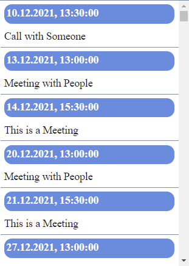
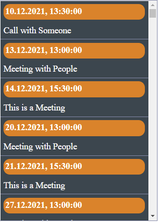

# ms-gcal
Import a public google calendar into a homepage.

## Images




## Examples

To add the calendar to your WP page, use the following shortcut.

```
	[ms_cal_lv apikey="yourApiKey" calendarid="yourCalendarId" theme="themeing"]
```

if you don't use WP, just include all scripts in the js folder to your homepage and trigger the load method.

```
    <script src="style/cal.css"></script>
	<script src="js/uriBuilder.js"></script>
	<script src="js/divBuilder.js"></script>
	<script src="js/calendar.js"></script>
	<script src="js/main.js"></script>
	<script> load(yourApiKey, yourCalendarId, divId, themeing); </script>

```


## Parameters

<ul>
	<li>apikey - The google calendar API key.</li>
	<li>calendarid - The google calendar identifier.</li>
	<li>divId - The div identifier. This is not necessary when the WP shortcut is used, as the shortcut creates a div identifier. </li>
	<li>theme - The theming currently available options.
		<ul>
			<li>empty</li>
			<li>dark</li>
			<li>orange</li>
			<li>card</li>
		</ul>
	</li>
</ul>

## Theming

To apply your own style feel free add it to the style folder located in the source directory. If you want to have your own style added to the plugin, feel free to create a pull request.
